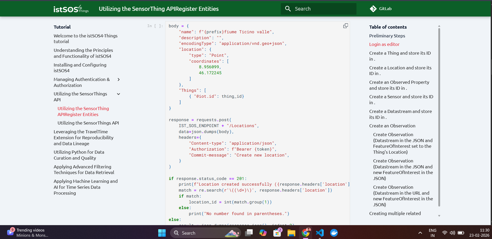

# SensorThings Metadata Harvester + STAC/DCAT API

This project harvests metadata from an istSOS SensorThings API and publishes it as:

- normalized metadata JSON
- STAC catalog, collection, and item documents
- DCAT catalog JSON-LD

The service exposes those views through a lightweight FastAPI application.

## What this project does

1. Authenticates to SensorThings with a bearer token or username/password.
2. Harvests `Things`, `Locations`, `Datastreams`, `Sensor`, and `ObservedProperty` using `$expand`.
3. Normalizes each datastream into a compact metadata record.
4. Builds a STAC landing page, collection metadata, item collections, and item documents.
5. Builds a DCAT JSON-LD catalog.
6. Supports incremental harvests with a persisted signature state file.

## Project structure

```text
istsos-metadata-connector/
|-- app/
|   |-- __init__.py
|   |-- api.py
|   `-- harvester.py
|-- collect_sensorthings_metadata.py
|-- docker-compose.yml
|-- Dockerfile
|-- requirements.txt
|-- test.ipynb
`-- README.md
```

## Metadata fields generated

Each record includes, when available:

- `thing_id`
- `thing_name`
- `datastream_name`
- `description`
- `location` as `{ "lat": <float>, "lon": <float> }`
- `sensor_type`
- `observed_property`
- `unit_of_measurement`
- `observation_type`
- `sampling_frequency`
- `time_range`
- `start_time`
- `end_time`
- `last_observation_time`
- `datastream_id`

Records without `datastream_id` are skipped.

## REST API

Base URL with Docker Compose: `http://localhost:8020`

- `GET /datasets` -> normalized metadata records
- `GET /stac` -> STAC landing page/catalog
- `GET /stac/conformance` -> STAC and OGC API conformance classes
- `GET /stac/collections` -> collection list
- `GET /stac/collections/{collectionId}` -> collection metadata
- `GET /stac/collections/{collectionId}/items` -> collection-scoped ItemCollection
- `GET /stac/collections/{collectionId}/items/{itemId}` -> single STAC item
- `GET /stac/search` -> queryable item discovery
- `POST /stac/search` -> body-based item discovery
- `GET /stac/items` -> compatibility alias for the default collection ItemCollection
- `GET /dcat/catalog` -> DCAT JSON-LD catalog

## Quick start

### 1. Start the stack

```bash
docker compose up -d --build
```

This starts the istSOS services plus the metadata connector on port `8020`.

### 2. Inspect the outputs

Harvested files are persisted under `/data` in the metadata service volume:

- `/data/metadata.json`
- `/data/stac_catalog.json`
- `/data/dcat_catalog.json`
- `/data/metadata_state.json`

### 3. Test the endpoints

```bash
curl http://localhost:8020/datasets
curl http://localhost:8020/stac
curl http://localhost:8020/stac/collections
curl http://localhost:8020/stac/collections/istsos-datastreams/items
curl http://localhost:8020/stac/search?limit=5
curl http://localhost:8020/dcat/catalog
```

### 4. Stop the stack

```bash
docker compose down
```

## Local CLI usage

```bash
python3 collect_sensorthings_metadata.py \
  --endpoint http://localhost:8018/istsos4/v1.1 \
  --username admin \
  --password admin \
  --incremental \
  --output metadata.json \
  --stac-output stac_catalog.json \
  --dcat-output dcat_catalog.json \
  --stac-collection-id istsos-datastreams \
  --stac-root-href http://localhost:8020/stac
```

Alternative interactive auth:

```bash
python3 collect_sensorthings_metadata.py --ask-login --output metadata.json
```

## Incremental harvest behavior

When `--incremental` is enabled:

- current records are compared with stored signatures from `metadata_state.json`
- unchanged records are reused
- new and changed records are refreshed
- removed datastreams disappear from the latest output

## Environment variables

Configured in `docker-compose.yml` under `metadata-api`:

- `METADATA_ENDPOINT`
- `METADATA_TOKEN`
- `METADATA_USERNAME`
- `METADATA_PASSWORD`
- `METADATA_INCREMENTAL`
- `METADATA_OUTPUT`
- `STAC_OUTPUT`
- `DCAT_OUTPUT`
- `METADATA_STATE_FILE`
- `STAC_COLLECTION_ID`
- `STAC_ROOT_HREF`
- `HARVEST_INTERVAL_SECONDS`

## STAC implementation notes

- The persisted STAC file is now a landing-page catalog, not just an item dump.
- The API exposes a proper collection resource and collection-scoped item endpoints.
- Items include `self`, `root`, `parent`, and `collection` links.
- The landing page advertises STAC and OGC API conformance classes.
- `GET /stac/search` and `POST /stac/search` provide API-style discovery over harvested items.

## Example outputs

CLI run:

```text
Wrote 1 records to metadata.json; STAC to stac_catalog.json; DCAT to dcat_catalog.json
```

Example STAC landing page shape:

```json
{
  "type": "Catalog",
  "stac_version": "1.0.0",
  "id": "istsos-stac-catalog",
  "title": "istSOS STAC API",
  "links": [
    { "rel": "self", "href": "http://localhost:8020/stac" },
    { "rel": "data", "href": "http://localhost:8020/stac/collections" },
    { "rel": "search", "href": "http://localhost:8020/stac/search" }
  ]
}
```

## Screenshots

### OAuth authorization in istSOS docs



### Things endpoint test in Swagger UI


### Tutorial reference used during implementation

.jpeg)
